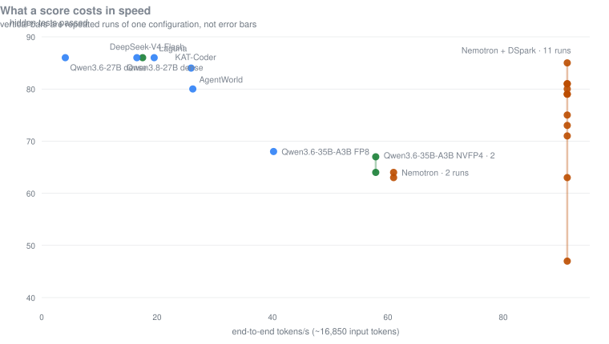
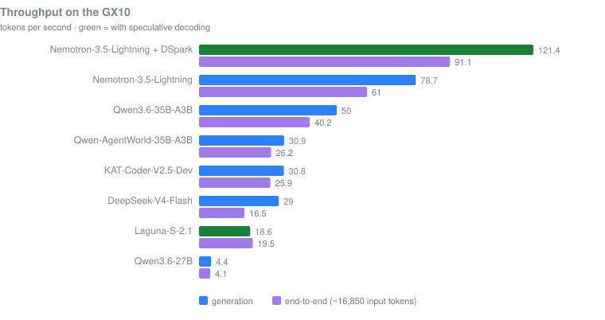
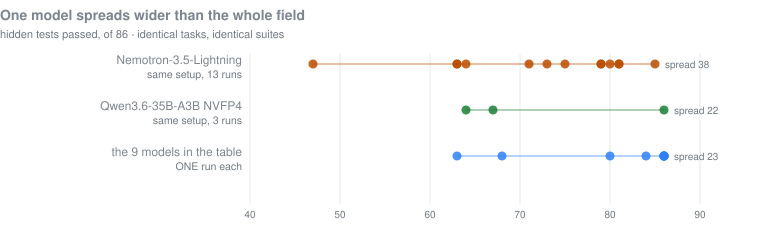
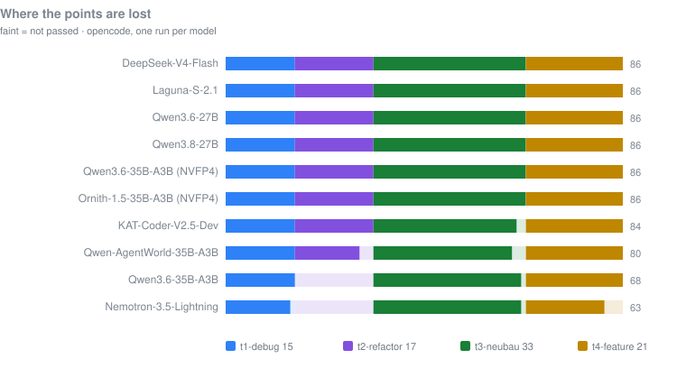

# Local agentic coding on 128 GB unified memory (DGX Spark class)

Seven large local LLMs, four realistic coding tasks, 86 hidden tests each, one
ASUS Ascent GX10 — **NVIDIA GB10, 128 GB unified memory**, the same chip and
memory configuration as the NVIDIA DGX Spark. Everything ran locally through
[opencode](https://opencode.ai), [Claude Code](https://claude.com/claude-code)
and [Oh My Pi](https://github.com/can1357/oh-my-pi) against endpoints on
`127.0.0.1` — no cloud API, no per-token cost. A fourth, purpose-built harness
was added later to test specific claims about the other three; see
[below](docs/harness.md#testing-that-theory-a-fourth-harness-written-to-check-one-claim).

Models: DeepSeek-V4-Flash, Laguna-S-2.1 (poolside), KAT-Coder-V2.5,
Qwen-AgentWorld-35B-A3B, Qwen3.6-27B, and — added later — NVIDIA
Nemotron-3.5-Lightning-30B-A3B and Qwen3.6-35B-A3B. Served with vLLM and a
llama.cpp-derived server.

This is the big-memory counterpart to
[local-agentic-coding-24gb](https://github.com/DG1001/local-agentic-coding-24gb),
which looked at seven small models on a 24 GB MacBook. The conclusions are
almost disjoint. On 24 GB the limiting factor was tooling — inference engines
breaking chat templates, KV cache blowing past the budget, system prompt size
pushing models off a cliff. On 128 GB almost none of that mattered: with
131,072-token context windows and millions of tokens of KV cache to spare, no
model here ran out of room, and four of the first five got at least 84 of 86
tests right. The two models added later scored markedly lower, and in both cases
the whole gap is one task graded all-or-nothing — worth reading before the
ranking is taken at face value.

What limits you here is **memory bandwidth**, and it decides which models are
worth running at all. And — the finding that surprised us most — **which agent
harness you point at the model changes not just how long it takes, but how many
tests pass.**

## The short version

### The original round: seven models, opencode, one run each

| Model | Type | Weights | Hidden tests | Wall clock | Tool calls | Own tests written |
|---|---|---|---|---|---|---|
| **DeepSeek-V4-Flash** | MoE | 88 GB | **86 / 86** | **25:49** | 57 | 73 |
| **Laguna-S-2.1** | MoE | 93 GB | **86 / 86** | 30:56 | 76 | 111 |
| **Qwen3.6-27B** | dense | 52 GB | **86 / 86** | **3:07:36** | 67 | 118 |
| KAT-Coder-V2.5-Dev | MoE | 65 GB | 84 / 86 | 25:59 | 169 | 79 |
| Qwen-AgentWorld-35B-A3B | MoE | 65 GB | 80 / 86 | 41:34 | 120 | 66 |
| **Qwen3.6-35B-A3B** (NVFP4) | MoE | 23 GB | **86 / 86** | **21:01** | 61 | 132 |
| **Qwen3.8-27B** (NVFP4 + MTP) | dense | 22 GB | **86 / 86** | >1:47 ‡ | 74 | 118 |
| Qwen3.6-35B-A3B (FP8) | MoE | 35 GB | 68 / 86 | 44:30 | 116 | 125 |
| Nemotron-3.5-Lightning-30B-A3B | MoE | 21 GB | 63–85 / 86 † | 36:29 | 220 | 54 |

‡ `t3-neubau` ran into the 90-minute cap with the work already finished — the
hidden suite passed 33/33 against what was on disk. That wall clock is a floor,
not a measurement, so the total is not comparable with the other rows.

† **Not a typo, and the most important number in this table.** Nemotron has
since been run **thirteen** times on the identical tasks, scoring anywhere from
47 to 85 — a 38-point spread, **wider than the whole field above**, every other
row of which is a single run. A second model repeated twice swung a full task
(16/17 to 0/17) between consecutive runs. Details in [one run is not a
measurement](docs/variance.md#one-run-is-not-a-measurement). Read the ranking accordingly: it
separates "solves this class of task" from "does not", and nothing finer.

Three models scored perfectly. The interesting column is wall clock: the dense
27B needed **7.3× longer than DeepSeek** for the exact same result. That gap is
not a software problem and it is not tunable. See below.

### The same model at two precisions

Qwen3.6-35B-A3B is the one model here measured twice at different precision
under the same harness, and the result is a warning rather than a finding:

| | Hidden tests | Wall clock | Generation |
|---|---|---|---|
| FP8 (35 GB) | 68 / 86 | 44:30 | 50.0 tok/s |
| **NVFP4 (23 GB)** | **86 / 86** | **21:01** | 78.3 tok/s |

The more aggressively quantized build scores *higher* and runs twice as fast.
That does not make 4 bits better than 8. **The entire difference is one task**,
`t2-refactor`, of which this model has now produced **0, 16, 0 and 17** across
four runs. The FP8 run drew a zero and this one a seventeen. Two single runs,
one confound removed, and the number still says nothing about precision — which
is the whole argument of [one run is not a
measurement](docs/variance.md#one-run-is-not-a-measurement) in one table.

What the pair does support is the throughput claim: 1.57× from halving the
bytes per weight, measured on identical hardware and software.

### What a score costs in speed



Everything above is in this one picture: score up, throughput right, and a
vertical bar wherever the same configuration was run more than once.

**Qwen3.6-35B-A3B at NVFP4 holds both ends: 86/86 in 21:01, at 57.9 end-to-end
tokens per second.** That is the fastest perfect run here — DeepSeek needs
25:49 at 16.5 tok/s, Laguna 30:56 at 19.5 — and it is three times further right
than either.

> **This replaces an earlier reading of the same chart.** Before that run, the
> four configurations at 86/86 all sat at 19.5 tok/s or below, and this section
> said nothing faster had ever reached full marks — that past some point the
> trade becomes speed against knowing what you will get. One run moved the
> frontier by a factor of three and the sentence did not survive it. A boundary
> drawn through the fastest point you happen to have measured is a statement
> about your sample, not about the machine.

What does survive is the shape of the bars. Nemotron with DSpark is the fastest
configuration on the chart and has scored anywhere from 47 to 85 across eleven
runs — that tall bar is not an error bar, it is eleven actual results. The same
Qwen3.6-35B-A3B that reached 86 also produced 64 and 67 on two earlier runs.
**Being fast does not cost you points; it does not buy you consistency
either.** The vertical extent of a bar, not its position, is what should decide
whether you would rely on a configuration.

## Hardware

- ASUS Ascent GX10 — NVIDIA GB10, 128 GB unified LPDDR5X (121 GiB usable),
  arm64, Ubuntu 24.04.4
- ~273 GB/s memory bandwidth (vendor spec, not measured here)
- vLLM 0.26.0 in Docker for six models, 0.27.1 for the DSpark measurement;
  `ds4-server` (llama.cpp-derived,
  from [DeepSeek-v4-Flash-One-DGX-Spark](https://github.com/MiaAI-Lab/DeepSeek-v4-Flash-One-DGX-Spark))
  for DeepSeek
- opencode 1.18.14, Claude Code 2.1.226 and Oh My Pi 17.2.12 as agent harnesses,
  plus a purpose-built Java harness for one follow-up question

Comparable hardware: the NVIDIA DGX Spark uses the same GB10 superchip and the
same 128 GB unified LPDDR5X, so the bandwidth findings below transfer directly.
Nothing here depends on the ASUS badge.

Only one model runs at a time — DeepSeek alone occupies ~113 GiB. The
[`tools/model-switch`](tools/model-switch) script in this repo stops whatever
is running before starting the next one.

## The four findings

Each is a link to the evidence, not a summary that stands alone.

### 1. Bandwidth decides which models are worth running

A dense model streams every weight for every token; a mixture-of-experts streams
only the active ones. On this machine that is a 27× spread between the fastest
and slowest model measured, and **no software fixes it** — the dense 27B runs at
84% of what 273 GB/s physically allows.

Quantization is the second lever and it is nearly as large: among models that
activate ~3B parameters, NVFP4 reads 78.7 tok/s where BF16 reads 30.8.
Speculative decoding is the third, worth another 1.5×.



→ [**Speed on this machine**](docs/speed.md) — the arithmetic, the
method, what quantization and speculative decoding are each worth, and a
correction to an earlier version of this table.

### 2. One run is not a measurement — and this is the big one

Every row of the summary table is a single run. Two models have since been run
repeatedly: Nemotron thirteen times, Qwen3.6-35B-A3B twice. **Nemotron's thirteen
runs span 38 points. The seven different models span 23.** Qwen's two runs
disagree by a whole task.



The ranking above therefore separates "solves this class of task" from "does
not", and nothing finer. Three separate explanations were offered for one of
those low scores before repetition showed all three were wrong.

→ [**One run is not a measurement**](docs/variance.md) — the three explanations,
why each failed, and what in this repo is *not* affected by it.

### 3. The loop decides whether you get what the model can do

Same model, same tasks, same limits — swapping opencode for Oh My Pi recovers
seven points across three named defects. Claude Code scores 9/86 on a
65K-context model because its own baseline footprint will not fit, and every
task dies in compaction thrashing.

There is a popular version of this: that the fastest way to improve an agent is
a better loop rather than a better model. The measurements here support it and
then narrow it. **Every harness win in this repo is the removal of a total
failure** — a turn that ended without acting, a compaction that discarded
finished work, a turn budget that cut mid-task, a four-token answer accepted as
a completed run. None of them made a good run better; each stopped a good run
from being thrown away.

And the one deliberate attempt to *add* points with a better loop measured
nothing. Asking the model to walk the task statement before finishing produced
**no further tool call at all in four of six cases** — it confirmed its own
requirements in prose, once while a broken import sat in the file. A model that
believes it is finished will say so when asked; checking needs an observation,
not a question.

→ [**What the harness is actually worth**](docs/harness.md#what-the-harness-is-actually-worth)
— the four failures it removed, the one improvement it did not deliver, and a
purpose-built Java harness written to test a claim.

### 4. Green tests are not acceptance

Every model ran `pytest` in every task. It told us nothing. Three models failed
the same task in three different ways, each with a green self-written suite,
each by building something that works instead of what was specified. One wrote
125 passing tests and scored 68/86.



→ [**The benchmark and what it found**](docs/benchmark.md) — task design, per-task
results, and the three defects in detail.

### Also here

→ [**Running these models**](docs/operations.md) — vLLM flags that cost real
debugging time, and three configuration traps that all fail mid-task.

## Limitations

Read the numbers with these in mind:

- **One run per model per task — and that is now the headline limitation, not
  a footnote.** The only model run three times spread 22 points across those
  runs, wider than first-to-last in the summary table. See [one run is not a
  measurement](docs/variance.md#one-run-is-not-a-measurement). Treat "these solve this class of
  task, those do not" as the finding; treat every ordering finer than that as
  unsupported.
- **The suite is too easy at the top.** Three of seven models scored perfectly.
  A benchmark where the top is crowded measures nothing at the top. The two
  later models did produce spread — but almost all of it comes from one
  all-or-nothing import in one task, which is spread from grading mechanics, not
  from difficulty.
- **Qwen3.6-35B-A3B ran once, under opencode only.** It and
  Nemotron-3.5-Lightning were added months after the original five, on the same
  tasks and the same 131,072-context configuration. Nemotron has since been run
  through the Java harness as well (64 / 86 against 63 / 86 — one point apart on
  the total, every task different underneath); Qwen3.6-35B-A3B has no second
  harness, so treat its 68 / 86 as a number about that pairing.
- **A one-run-per-pairing benchmark hides more movement than the totals show.**
  The first two Nemotron runs differ by a single point and disagree on all four
  tasks, including *which* five points `t4` loses; the third differs from both by
  21 points. Where this repo reports a gap, assume noise unless a named defect is
  attached to it.
- **Four tasks, one language, one domain.** All Python, all small self-contained
  repos, all with fully specified signatures. Nothing here says anything about
  large unfamiliar codebases, other languages, or ambiguous requirements.
- **The 5090 section is arithmetic**, not measurement.
- **Quantization differs across models** (GGUF IQ2_XXS-based mixed for
  DeepSeek, NVFP4 for Laguna, BF16 for the three Qwen-family models). This is
  a comparison of *usable local setups*, not of model weights under equal
  conditions. One model has since been measured at two precisions —
  Qwen3.6-35B-A3B at FP8 and NVFP4 — and scored in the same band while running
  1.57× faster. That is one data point on one model, not a general result.
- **Bandwidth figure is vendor spec**, not independently measured.
- **The harness comparison is one run per pairing.** Oh My Pi covers four
  models, Claude Code only Laguna (at 65K context — it never got far enough to
  be worth extending). Seven recovered points across three distinct defects is
  a pattern, not a proof; a second run per pairing could move any single number.
- **The Java harness ran once per model, on two of the original five.** It answers a
  single question — was the `t3` failure a harness behaviour — and answers it
  clearly, because the failure mode was specific and the fix targeted it
  directly. Both models reaching 86/86 makes the parity harder to dismiss as
  luck, but it is still two runs. It is not evidence that it would hold up on
  harder work, on the other three models, or on anything resembling a real
  codebase. It was written to test a claim, not to be used.
- **Qwen3.6-27B was deliberately skipped in the Oh My Pi round.** At 4.5 tok/s
  it took 187 minutes under opencode; at Oh My Pi's 2–3× that is over ten hours
  for a model already shown to be impractical here. An omission, not a gap in
  the data.

## Layout

```
README.md                 the four findings, with the charts
docs/                     also published at
                          dg1001.github.io/local-agentic-coding-128gb
  index.md                the four findings, with the charts
  speed.md                bandwidth, throughput method, quantization, DSpark
  variance.md             why one run per model is not enough
  benchmark.md            task design, per-task results, the named defects
  harness.md              opencode vs Oh My Pi vs Claude Code vs the Java harness
  operations.md           vLLM flags and configuration traps
  charts/                 four charts, regenerated by tools/charts.py from results/
bench/
  run.sh                  runs all four tasks for one model, then grades
  run-claude-code.sh      same four tasks, Claude Code as the harness
  run-omp.sh              same four tasks, Oh My Pi as the harness
  run-java.sh             same four tasks, the purpose-built Java harness
                          (github.com/DG1001/jaja)
  tasks/<task>/
    task.md               the prompt handed to the agent, verbatim
    seed/                 starting repository (absent for t3-neubau)
    test_bench.py         hidden grading suite — never visible to the model
results/
  measurements.json       opencode runs, machine-readable
  omp-measurements.json   Oh My Pi runs, machine-readable
  throughput.json         tokens/s for every model, one method, with the method
  variance.json           every repeated run of the same model
  java-measurements.json  purpose-built-harness runs, machine-readable
  logs/                   per-model, per-harness timeline of each run
                          (including all three Nemotron runs)
tools/
  model-switch            starts exactly one model, stops the others
  charts.py               regenerates docs/charts/*.svg from results/*.json
  pruefe-seeds.sh         checks the published task seeds still match the
                          working copy the runs are measured from
  cc-local                launches Claude Code against a local model
configs/
  opencode.json           the seven providers as configured
  omp-models.yml          the models for Oh My Pi (the original five)
```

Reproducing a run:

```bash
./tools/model-switch kat   # ds4 | laguna | agentworld | qwen27b | nemotron |
                           # qwen36moe | nemotronspec (Nemotron + DSpark, vLLM 0.27.1)
./bench/run.sh kat kat/kat-coder-v2.5       # <label> <opencode provider/model>
```

Results land in `runs/<label>/`. Requires opencode, Docker, Python 3.12 and
the models on disk.

### One harness note

Long `opencode run` invocations must be detached with `setsid`, or a session
manager can reap them mid-flight and take the child process with it. Two early
runs died this way and looked like model failures until the logs said
otherwise. `run.sh` writes a completion file that an external watcher polls.

## License

MIT — see [LICENSE](LICENSE). The seed repositories and task descriptions are
part of this repo and under the same license; the models themselves are not,
and each carries its own terms.
